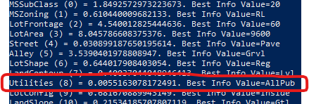
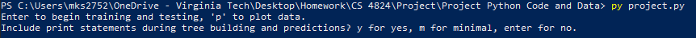
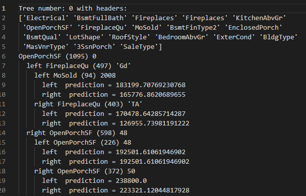
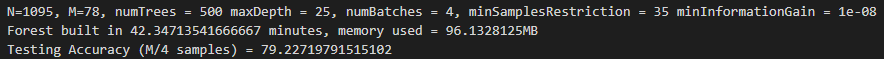
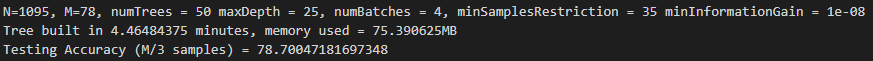
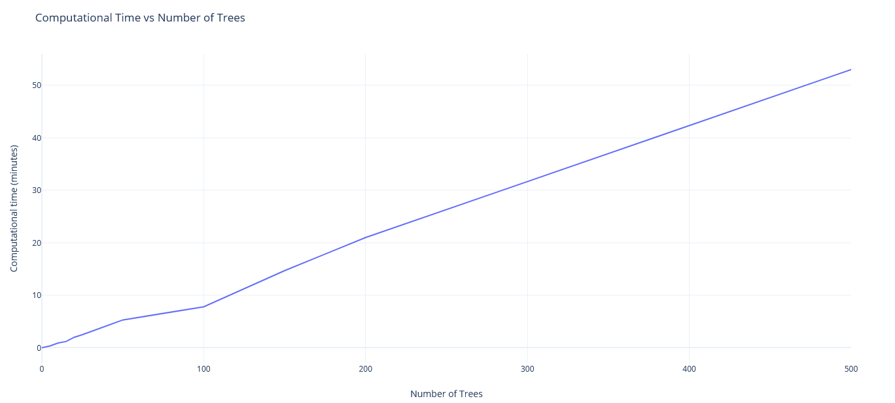
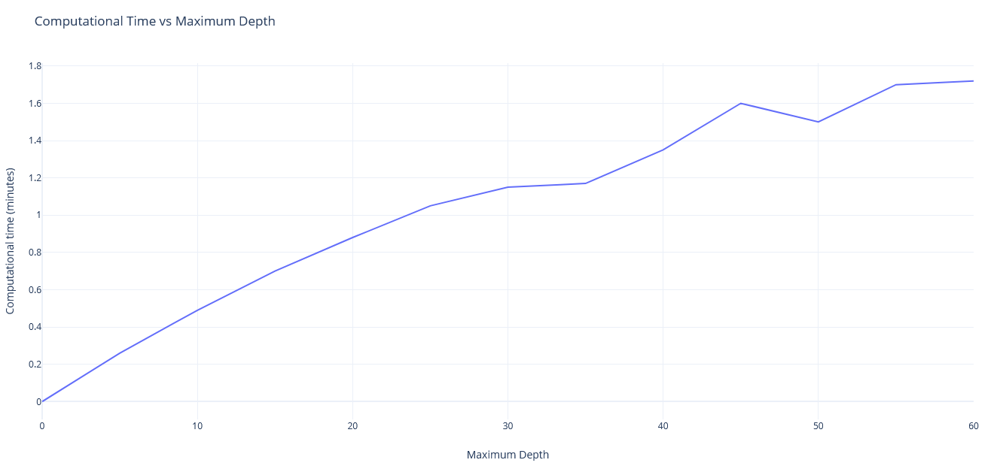
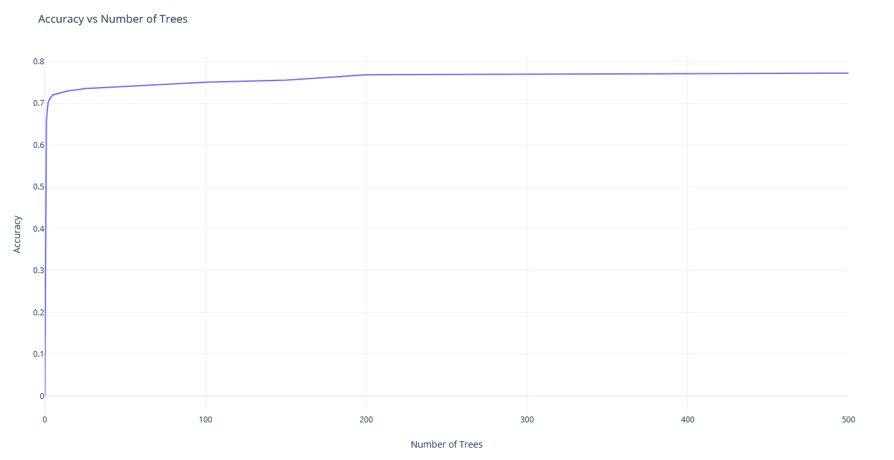

**Abstract** -- In this paper a Random Forest model is presented using
Information Gain and Entropy for each split on a decision tree. A
"batch" method is used to build each decision tree in the forest. The
model creates X number of decision trees and calculates the average of
each prediction to determine a best estimate. The best accuracy recorded
is: 79.22%. It took 42 minutes to build the forest with 96MB of memory
used. However, adjusting the hyperparameters further may help.

# Introduction

The purpose of this project is to choose a model that will suit a
dataset that the student finds interesting. I chose to implement a
Random Forest, also known as Ensemble, model with a dataset of house
prices based on house features. The data consists of different facets of
a house (Kaggle.com Overview). This includes the square footage, if a
garage exists, the lot area, if the street is paved, and many more
descriptions of a house. There are 79 total features in the training and
testing set with 1461 and 1460 samples respectively.

Using this data, the model builds a decision tree by determining the
best split for each decision node until some conditions are met. In
order to prevent overfitting and increase testing accuracy X number of
decision trees are created, this is called the Random Forest. Given a
set of data each tree in the Forest can predict the cost of each sample
in the data. These predictions are averaged to obtain the final
prediction for that sample.

# Theoretical Description

The Random Forest model is based on creating several decision trees and
comparing their results for the best prediction. The process for
creating the forest follow:

(1) The algorithm begins constructing decision trees one by one,
    randomizing the data columns for each tree to consider into K
    batches.

(2) Among the k features a decision tree is built by calculating the
    best split point.

(3) This splits the data into two nodes based on the feature with the
    best information gain.

(4) Steps 1-3 are repeated until some maximum depth is reached or
    minimum samples condition is met.

(5) Steps 1-4 are repeated until X number of decision trees are created.

**Pseudocode:**

1 function randomForest(data, targets)\
2 for i to numTrees chosen number of trees in the forest\
3 randomizedFeaturesData random k columns from the data\
4 buildTree(randomizedFeaturesData, targets...)\
5 append to forest\
6 return forest\
7\
8 function buildTree(data, targets...)\
9 if maximum depth reached or too few samples\
10 return prediction\
11 split the data into left and right nodes using the best feature\
12 return sub tree the Node which contains the recursed left and right
Nodes

After the Random Forest creation, targets can be predicted from any
number of samples. The predictions algorithm simply takes each of the
decision trees in the Random Forest and averages each prediction for
that sample to give a robust prediction value. In the case of
Classification (rather than the previously stated Regression) instead of
taking the average, the robust prediction is determined by a majority
vote.

# Implementation Details

## Overview and Data Analysis

The program starts by grabbing samples and targets from the CSV file
(getData(), line 37). This function simply retrieves the data from the
CSV and organizes it into arrays for training features, training
samples, and testing features. Some unnecessary columns are removed from
the training and testing sets.

This unnecessary data is found by calling printInitialInformationGain()
(line 392) and manually determining which features should be removed
(figure 1). Any features with a relatively very small (\<0.006) amount
of information gain are removed. After removing these features a more
consistent accuracy is observed.

{width="4.575694444444444in"
height="1.5375in"}\
Figure 1. Initial information gain shows that column 8 (Utilities)\
provides the least information gain

The program then asks if you would like to plot or begin model
creation/testing (line 448). If the user chooses to plot it asks which
column to plot and if it should be a scatter plot or bar chart. If the
user chooses to begin training another prompt is shown. The user has the
option to print model information while the model is being built (the
minimal option only prints when a new tree is being built). The
randomForest function is called and Random Forest creation begins (line
480).

The Random Forest starts by creating X trees based on the numTrees
variable in a for loop (line 324). The data is randomized by selecting k
(k = M/numBatches, M = total number of features) features in each
"batch" (line 335). Each tree is appended to the forest list. This list
is returned after numTrees have been created.

Every decision tree begins with a set of training data which is fed into
a "buildTree" function (line 254). This is a recursive function which
first checks some conditions to determine if it should return a
prediction or another Node; the maximum depth of the tree has not been
reached and if this node has enough samples (line 275). If these two
conditions are met the algorithm attempts to split the node into a left
node and a right node. Upon splitting, if the samples don't consist of
only "NA" values, the algorithm calls the "buildTree" function for the
left and right nodes and their respective data. Otherwise it creates a
prediction leaf node (lines 306, 319). This process is repeated until
the maximum depth has been reached or there aren't enough samples to
split.

After the Random Forest is created the accuracy is tested with some
training samples that were set aside for testing in getData() (lines
70-73). A "logs.txt" file is created, or appended to, with the
information on the hyperparameters and testing accuracy (line 512). A
"tree-logs.txt" file is also created to log each tree and it's structure
(line 518).

## Detailed Descriptions

### Structure

A decision tree consists of several "Node" classes (line 11). Every Node
contains the variables; left, right, data, key, name, numSamples,
isString, and colHeaders. The left and right variables are also meant to
be Node classes which, for the purpose of this project, are nodes to
separate data on a split. The data, key, and name variables store
information to determine a split on prediction. numSamples is the number
of samples in this Node, mainly used for information output. isString
tells if the feature column that this node is split on contains String
objects (True if it is a String). colHeaders provide the column headers
for this set of data since the order of the features is randomized.

###  Splitting

**Variables:**

-   bestSplitVal -- The optimal split value for the selected feature

-   bestSplitCol -- The column where the optimal split feature exists

-   bestSplitName -- The feature name (used for printing information and
    predictions)

-   isString -- If the node is split on a string. True for non-numeric
    values, False for numeric values

-   numSamples -- The number of samples in the node during training

-   colHeaders -- The column headers for the node.

**Algorithm:**

To determine the best split the algorithm takes into consideration the
current node's data and returns the optimal data column that the split
should be made (bestSplit(), line 137). This is done by determining the
information gain, using a simple Entropy algorithm (line 91, figure 2).
If the feature with the best information gain only contains the "NA"
value for each sample None values are returned to indicate there is no
best split.

$$E = \sum_{i = 1}^{c}{- p_{i}\log_{2}(p_{i})}
$$

$$IG = E(Parent) - E(Split)
$$

During the splitting process (split(), line 156) samples are placed into
left and right data arrays along with their training targets. The left
array contains values that are equivalent to the bestSplitVal (obtained
from bestSplit()) for categorical features, and it contains values that
are less than or equal to the bestSplitVal for numerical features. The
right array contains values that are labelled "NA" and non-equivalent
(or greater than for numerical features) to the bestSplitVal. These left
and right split arrays and column headers are returned to buildTree()
(line 288). They are then placed into the respective left and right
nodes along with the splitting information to be later accessed;
bestSplitVal, bestSplitCol, bestSplitName, isString, numSamples, and
colHeaders.

## Hyperparameter Tuning and Graphs

Hyperparameters are the parameters when building a Random Forest that
can help to fine-tune predictions. A break-down of each hyperparameter
follows. For descriptions of each hyperparameter see the Reproducibility
section:

-   numTrees -- Increases accuracy but increases computational time.

    -   Think of this parameter as increasing the number of people you
        go to for advice about a topic. The more voices you get the more
        information you can parse through to make an accurate
        observation. However, the more people you talk to increases the
        time it takes to make the observation.

-   maxDepth -- Increases the accuracy as maxDepth increases, up to a
    certain amount

    -   This parameter can be tuned for a set of data. A decision tree
        is able to split a certain number of times until there is no
        more information to be gained from a split. In the house pricing
        index data the optimal maximum depth is around 25, depending on
        the random features selected.

-   numBatches -- Lowers the correlation among trees

    -   This parameter can be tuned to decrease the correlation between
        each of the trees which strengthens the Random Forest increasing
        accuracy. The normal optimal value for this parameter in a
        regression problem is M/3, where M is the number of features
        (Breiman, Leo, 2001). However, I found that roughly M/4 works
        well for this data set.

-   minSamplesRestriction -- Prevents overfitting by restricting sample
    size for a node

    -   This parameter simply prevents overfitting by restricting the
        minimum number of samples allowed on each node for a split. With
        categorical features this parameter doesn't get used often.
        However, with numeric features the parameter helps to prevent a
        leaf node containing a small amount of data points.

-   minInformationGain -- Prevents overfitting

    -   The minimum information gain required for a node to split can
        help with overfitting. However, if it's set to a value that is
        too high it will begin to underfit the data and prevent the tree
        from growing to it's best height.

# Reproducibility

## Model Building and Testing

Training and testing data can be found at the following URL:
https://www.kaggle.com/c/house-prices-advanced-regression-techniques/data

Because of the randomized feature selection, it will be hard to obtain
the exact results shown in this report. However, to reproduce the
results roughly simply change the variables at lines 452-456. Run the
program "py project.py", then follow the prompts on the command line
(figure 4). A quick start is to press enter twice to build the forest
and test the accuracy without any additional information printed during
model building.

{width="6.5in"
height="0.36180555555555555in"}\
Figure 4. Example user inputs

-   numTrees -- The number of trees in the Random Forest

-   maxDepth -- The maximum depth of each decision tree

-   minSamplesRestriction -- The minimum number of samples allowed in a
    node before it is transformed into a leaf node

-   minInformationGain -- The minimum amount of information gain allowed
    for a split to have. The split is changed to a leaf node if this
    condition is met.

-   numBatches -- The number to divide the total number of features by.
    Each tree uses (total number of features)/(numBatches) features for
    training.

## Plotting

The plotting functions are very basic. In the scatter plot, the column
that you select is plotted against the home price. In the bar graph it
is plotted against the number of occurrences of data in that column.
It's highly recommended to use only use categorical columns for the bar
plot. Scatter plots are only compatible with numeric columns.

To begin plotting on the first input prompt type 'p' and hit enter. For
each plot type 'bar' for a bar plot or 'int' for a scatter plot.

## Information Printing

Tree structure and initial information gain can be printed easily by
calling their respective functions. After training and testing has been
completed the forest structure, hyperparameters, and testing error rate
is automatically exported to log files. To print a tree structure call
the Node's printTree() function (line 23). Calling printTree() on a Node
returns a string with the sideways structure of a tree (figure 5). To
print the initial information gain call printInitialInformationGain()
(line 392). This will print the information gain for each feature before
any splitting has occurred. Uncomment line 53 to easily run the initial
information gain before training/plotting begins.

{width="3.6251049868766403in"
height="2.323173665791776in"}\
Figure 5. Example decision tree structure

# Results

## Best Results

The best results in terms of accuracy occur at a large number of trees
with a maximum depth of 25 and 4 batches (figure 6). Although these were
the best results, they don't show the optimal hyperparameters. As you
can see in figure 6, building the forest takes 42 minutes. Unless time
isn't a concern in building the model or prediction this isn't optimal.
A submission that I posted to Kaggle received a root mean squared score
of 0.30734 (Kaggle.com).

{width="6.5in"
height="0.4340277777777778in"}\
Figure 6. Best results from testing different hyperparameters and
ignoring computational time

## Optimal Results

The optimal results occur when the; number of trees is large (\~50),
maximum depth is roughly 25, number of batches is 4, and the minimum
sample restrictions is 35 (figure 7). These optimal parameters were
found by first increasing the maximum depth until the error rate
plateaued. The minimum sample restrictions are specific to the data
provided by my best guess from trial and error, it was chosen to be
\~35. The number of batches is optimal at M/3 (Breiman, Leo, 2001).
However, at 4 batches it was observed that the error rate is more
consistent.

{width="6.5in"
height="0.45416666666666666in"}\
Figure 7. Optimal computation time in regard to accuracy

The hyperparameters in regards to computational time is dynamic. Less
trees and a shallower depth are better for faster computational time
(figure 8, figure 9). However, if your goal is to increase accuracy,
more trees and a depth of \~25 is the best (figure 10). Therefore, as
the number of trees and maximum depth in the forest increases, so does
the computational time and memory used.

{width="6.524258530183727in"
height="2.9470680227471564in"}\
Figure 8. Computational time of increased number of trees

{width="6.5in"
height="3.0541666666666667in"}\
Figure 9. Computational time of increased maximum depth

{width="5.790487751531058in"
height="2.9837095363079613in"}\
Figure 10. As the number of trees increases so does the accuracy.

# References

Koehrsen, W. (2018, January 10). Hyperparameter tuning the random forest
in python. Medium.

> Retrieved December 7, 2021, from
> https://towardsdatascience.com/hyperparameter-tuning-the-random-forest-in-python-using-scikit-learn-28d2aa77dd74.

Breiman, Leo., Statistics Department University of California, 2001.
*Random Forests*. University of California, Berkeley, CA.

\"House Prices - Advanced Regression Techniques Score \| Kaggle\".
*Kaggle.Com*, 2021,
https://www.kaggle.com/c/house-prices-advanced-regression-techniques/leaderboard#score.

\"House Prices - Advanced Regression Techniques Overview \| Kaggle\".
*Kaggle.Com*, 2021,
https://www.kaggle.com/c/house-prices-advanced-regression-techniques/overview.
